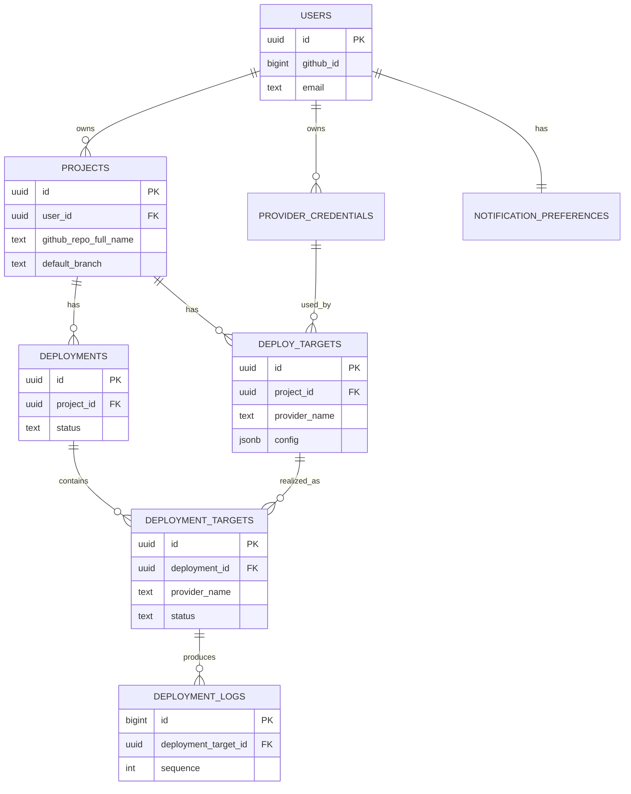

# DeployHub — Data Model

## 1. Overview

The schema is deliberately small and generic. Provider-specific detail is pushed into JSON columns rather than per-provider tables, which is what keeps the system extensible: adding a provider never means adding a table.

## 2. Entities

### users

The authenticated account, backed by GitHub identity.

| Column | Type | Notes |
|--------|------|-------|
| id | uuid | PK |
| github_id | bigint | Unique; from GitHub |
| github_login | text | GitHub username |
| email | text | Notification address |
| github_token_encrypted | bytea | AES-256 encrypted |
| created_at | timestamptz | |
| updated_at | timestamptz | |

### provider_credentials

A user's API token for one hosting provider.

| Column | Type | Notes |
|--------|------|-------|
| id | uuid | PK |
| user_id | uuid | FK → users.id |
| provider_name | text | e.g. "vercel", "railway" |
| token_encrypted | bytea | AES-256 encrypted |
| label | text | Optional user-friendly name |
| is_valid | boolean | Result of last validation |
| last_validated_at | timestamptz | |
| created_at | timestamptz | |

Unique constraint on `(user_id, provider_name, label)` so a user can hold more than one token per provider if needed.

### projects

A repository the user wants to deploy.

| Column | Type | Notes |
|--------|------|-------|
| id | uuid | PK |
| user_id | uuid | FK → users.id |
| name | text | Display name |
| github_repo_full_name | text | e.g. "abdul/my-app" |
| default_branch | text | e.g. "main" |
| created_at | timestamptz | |
| updated_at | timestamptz | |

### deploy_targets

Links a project to a provider, with provider-specific config. One project can have many targets.

| Column | Type | Notes |
|--------|------|-------|
| id | uuid | PK |
| project_id | uuid | FK → projects.id |
| provider_name | text | e.g. "vercel" |
| credential_id | uuid | FK → provider_credentials.id |
| provider_project_id | text | The id/slug on the provider side |
| config | jsonb | Build settings, env var refs, etc. |
| created_at | timestamptz | |

The `config` jsonb column is the extensibility hinge — each provider reads whatever shape it needs without schema changes.

### deployments

One deploy action for a project. Groups per-provider results.

| Column | Type | Notes |
|--------|------|-------|
| id | uuid | PK |
| project_id | uuid | FK → projects.id |
| branch | text | Branch deployed |
| triggered_by | text | "user" or "webhook" |
| status | text | pending / in_progress / success / failed / partial |
| started_at | timestamptz | |
| completed_at | timestamptz | Nullable |
| created_at | timestamptz | |

`partial` covers the multi-provider case where some targets succeed and others fail.

### deployment_targets

The result of deploying to one provider within a deployment.

| Column | Type | Notes |
|--------|------|-------|
| id | uuid | PK |
| deployment_id | uuid | FK → deployments.id |
| deploy_target_id | uuid | FK → deploy_targets.id |
| provider_name | text | Denormalized for convenience |
| provider_deployment_id | text | Id returned by the provider |
| status | text | pending / in_progress / success / failed |
| deploy_url | text | Live URL when available |
| started_at | timestamptz | |
| completed_at | timestamptz | Nullable |

### deployment_logs

Persisted log lines for replay after a deploy finishes.

| Column | Type | Notes |
|--------|------|-------|
| id | bigint | PK, identity |
| deployment_target_id | uuid | FK → deployment_targets.id |
| sequence | int | Ordering within a target |
| line | text | Log content |
| logged_at | timestamptz | |

Indexed on `(deployment_target_id, sequence)` for fast ordered replay.

### notification_preferences

| Column | Type | Notes |
|--------|------|-------|
| user_id | uuid | PK, FK → users.id |
| email_on_success | boolean | Default true |
| email_on_failure | boolean | Default true |
| slack_webhook_url_encrypted | bytea | Nullable, later phase |

## 3. Relationships

```
users 1───∞ provider_credentials
users 1───∞ projects
projects 1───∞ deploy_targets
provider_credentials 1───∞ deploy_targets
projects 1───∞ deployments
deployments 1───∞ deployment_targets
deploy_targets 1───∞ deployment_targets
deployment_targets 1───∞ deployment_logs
users 1───1 notification_preferences
```

## 4. Entity-relationship diagram (mermaid)



## 5. Indexing strategy

- `users.github_id` — unique index (lookup on login).
- `projects.user_id` — index (dashboard listing).
- `deployments.project_id` + `created_at desc` — composite index (history listing).
- `deployment_logs (deployment_target_id, sequence)` — composite index (ordered replay).
- `deploy_targets.project_id` — index (loading a project's targets).

## 6. Encryption at rest

The following columns are encrypted via EF Core value converters using AES-256, with the key sourced from a secret manager (never in the database):

- `users.github_token_encrypted`
- `provider_credentials.token_encrypted`
- `notification_preferences.slack_webhook_url_encrypted`

Encryption happens on write and decryption on read, transparently to the application layer. Encrypted columns are `bytea`.

## 7. Migrations

Managed with EF Core migrations. Initial migration creates all MVP tables. Adding a provider requires **no migration** — provider-specific data rides in the existing `config` jsonb and the `provider_name` text columns.

## 8. Why no per-provider tables

A tempting but wrong design is `vercel_deployments`, `railway_deployments`, etc. That couples the schema to the provider set and forces a migration for every new provider — the opposite of the extensibility goal. Instead, `provider_name` + `jsonb config` absorb all variation, and the application's provider implementations interpret them.
