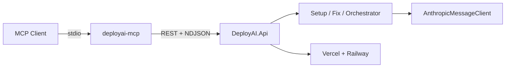

# DeployAI MCP

Architecture and tool reference for the DeployAI Model Context Protocol server.

## Overview

The DeployAI MCP server (`mcp/deployai-mcp/`) enables AI agents in Cursor, Claude Desktop, and other MCP clients to orchestrate split-origin deployments without reimplementing DeployAI business logic.



## Design principles

1. **Thin adapter** — MCP tools map 1:1 to existing REST endpoints in [`docs/04-api-spec.md`](../04-api-spec.md).
2. **No provider bypass** — never call Vercel/Railway APIs directly; DeployAI handles credential encryption and scoping.
3. **Poll over push** — MCP clients use `get_deployment` + `get_deployment_logs` instead of SignalR.
4. **Stream aggregation** — long-running Claude operations consume NDJSON server-side and return `{ progress, result }`.

## Authentication flows

### Phase 1 (current): JWT env vars

```
DEPLOYAI_API_URL=http://localhost:5000
DEPLOYAI_ACCESS_TOKEN=<jwt>
DEPLOYAI_REFRESH_TOKEN=<jwt>
```

The API client auto-refreshes on `401` via `POST /api/auth/refresh`.

### Phase 2 (current): mcp_auth tool

1. Opens browser → `GET /api/auth/github/login`
2. User completes GitHub OAuth
3. Tokens appear in frontend callback URL query params
4. User passes `callback_url` to `mcp_auth` or pastes tokens directly
5. Tokens persisted to `~/.deployai/mcp-tokens.json`

### Phase 3 (planned): API keys + remote HTTP MCP

- Long-lived `da_...` API keys with scoped permissions
- Hosted HTTP MCP endpoint for multi-app access without local stdio
- See plan todo `phase3-api-keys`

## Tool → API mapping

| MCP Tool | HTTP Endpoint |
|----------|---------------|
| `health_check` | `GET /api/health` |
| `list_projects` | `GET /api/projects` |
| `get_project` | `GET /api/projects/{id}` |
| `list_deployments` | `GET /api/projects/{id}/deployments` |
| `get_deployment` | `GET /api/deployments/{id}` |
| `trigger_deployment` | `POST /api/projects/{id}/deployments` |
| `get_deployment_logs` | `GET /api/deployments/{id}/logs` |
| `verify_deployment` | `POST /api/deployments/{id}/verify?scope=` |
| `list_github_repos` | `GET /api/github/repos` |
| `get_deployment_plan` | `GET /api/github/repos/{o}/{r}/deployment-plan` |
| `scan_deployment_readiness` | `POST .../deployment-readiness` |
| `generate_deployment_setup` | `POST .../deployment-setup` (NDJSON) |
| `merge_deployment_setup` | `POST .../deployment-setup/merge` |
| `generate_deployment_fix` | `POST /api/deployments/{id}/targets/{targetId}/fix` (NDJSON) |
| `generate_verification_fix` | `POST /api/deployments/{id}/verification-fix` (NDJSON) |
| `merge_deployment_fix` | `POST .../deployment-fix/merge` |
| `list_credentials` | `GET /api/credentials` |
| `list_provider_projects` | `GET /api/credentials/{id}/projects` |

## Streaming endpoints

Setup and fix tools call NDJSON endpoints with a 45-minute timeout. Events:

| Event | Meaning |
|-------|---------|
| `started` | Operation began |
| `log` | Progress message (aggregated into `progress[]`) |
| `complete` | Final result (PR URL, committed files) |
| `error` | Failure with `code` + `message` |

## Relationship to other MCP servers

| Server | Role |
|--------|------|
| **deployai** (this) | High-level orchestration, Claude agents, verification |
| **railway** | Low-level Railway ops (env vars, domains, raw deploys) |
| **vercel** | Low-level Vercel ops (projects, env, deployments) |

Agents should prefer **deployai** for project-scoped workflows and fall back to provider MCP for infrastructure debugging.

## Cursor configuration example

```json
{
  "mcpServers": {
    "deployai": {
      "command": "node",
      "args": ["mcp/deployai-mcp/dist/index.js"],
      "env": {
        "DEPLOYAI_API_URL": "http://localhost:5000",
        "DEPLOYAI_ACCESS_TOKEN": "<paste-after-login>",
        "DEPLOYAI_REFRESH_TOKEN": "<paste-after-login>"
      }
    }
  }
}
```

**Do not commit tokens.** `.cursor/mcp.json` is gitignored.

## Error handling

API errors return MCP tool results with `isError: true`:

```json
{
  "code": "provider_token_invalid",
  "message": "Your Vercel token is no longer valid. Reconnect it in settings."
}
```

## Source of truth files

| File | Purpose |
|------|---------|
| `mcp/deployai-mcp/src/api/client.ts` | HTTP client |
| `mcp/deployai-mcp/src/api/types.ts` | DTOs (mirrors `client/.../api.models.ts`) |
| `client/src/app/core/services/api.service.ts` | Angular API facade (reference) |
| `docs/04-api-spec.md` | Canonical REST contract |

## Future work

- API keys entity + auth middleware in `DeployAI.Api`
- Remote HTTP MCP transport (hosted endpoint)
- MCP prompts: `split_origin_setup`, `fix_failed_deployment`
- MCP resources: split-origin playbook content
