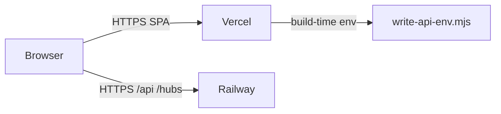

# Split-origin deployment playbook (Angular + Vercel + Railway)

DeployAI uses **split-origin** wiring for Angular frontends on Vercel with .NET APIs on Railway. The browser calls the Railway API directly; Vercel does **not** proxy `/api` or `/hubs`.

## Architecture

## Required repository files (blocking)

| File | Purpose |
|------|---------|
| `railway.toml` | Dockerfile-based Railway deploy |
| `{client}/vercel.json` | SPA-only rewrites (no `/api` proxy) |
| `{client}/scripts/write-api-env.mjs` | Injects `apiBaseUrl` at build time |
| `{client}/src/app/core/interceptors/api-base.interceptor.ts` | Rewrites `/api/` and `/hubs/` to Railway |
| `{client}/angular.json` | `fileReplacements` or build invokes `write-api-env.mjs` |
| `{client}/src/app/app.config.ts` | Registers `apiBaseInterceptor` |
| `{server}/Controllers/HealthController.cs` | Railway health probe |

## Environment variables

### Vercel
- `DEPLOYAI_API_URL`, `API_BASE_URL`, `NG_APP_API_URL`, or `API_URL` → Railway API URL (no trailing slash). See `CrossProviderUrlWiring.ResolveApiEnvKeys` for the canonical list.

### Railway
- `AllowedOrigins__0`, `AllowedOrigins__1`, … → Vercel production and preview origins
- `App__BaseUrl` → public API URL when needed

## Recommended (warn, do not block deploy)

- `Program.cs` — forwarded headers, CORS with `*.vercel.app`
- `AuthController.cs` — `SameSite=None; Secure` refresh cookies in Production
- Auth service — `withCredentials: true` on login/refresh/logout
- SignalR service — absolute hub URL in production
- `docs/DEPLOYMENT.md` — team runbook

## Anti-patterns

- **Do not** add Vercel rewrites for `/api/:path*` or `/hubs/:path*` on split-origin stacks
- **Do not** rely on same-origin `/api` from the Vercel domain (returns SPA HTML or 405)

## DeployAI automation

1. **Readiness scan** at HEAD SHA before publish
2. **Setup branch + PR** generates missing files via templates (Claude optional)
3. **Publish** pins `GitCommitSha` on Vercel and Railway deploys
4. **URL sync** sets cross-provider env vars (`EnsureWebsiteWiring` option)

## Deploy failure fixes

See [deploy-failure-fix.md](./deploy-failure-fix.md) for the Claude-assisted build error workflow on failed publishes.

## Reference

- Legacy same-origin proxy mode is used whenever the wiring mode isn't split-origin — i.e.
  any frontend/backend combination other than an explicitly Angular frontend paired with a
  .NET backend (see `CrossProviderUrlWiring.ResolveWiringMode`). This includes non-Angular
  frontends, and Angular frontends paired with a non-.NET backend.
